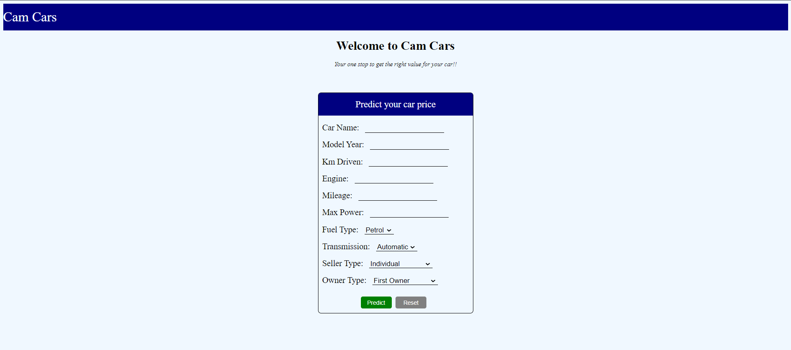

# Car Price Prediction

## Problem Statement:
Given the various features of car such as model year, power, engine capacity and other relevent features predict the selling price of car.

## Overview:
this projects aims to predict the selling price of cars based from the data collected which consits of various features of car such as power, engine capacity, mileage and other relevent features. By analysing the model and building the predictive model we can estimate the selling price of car.

## Features:
* Input Features: name, year, mileage, seat, power,engine, transmission, fuel type, km driven, owner, seller type
* Target: selling price

## Models used:
* Linear Regression
* SVR
* KNearest Regressor
* Decision Trees
* Ensemble Learning( Random Forest, XGBoost Regressor, AdaBoost)

## Prediction Result:
Best model to use is Random Forest with 0.96 R2 score

## Sample:

  
